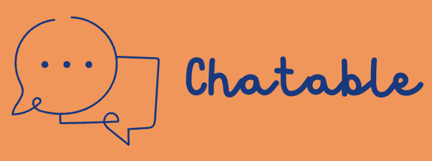
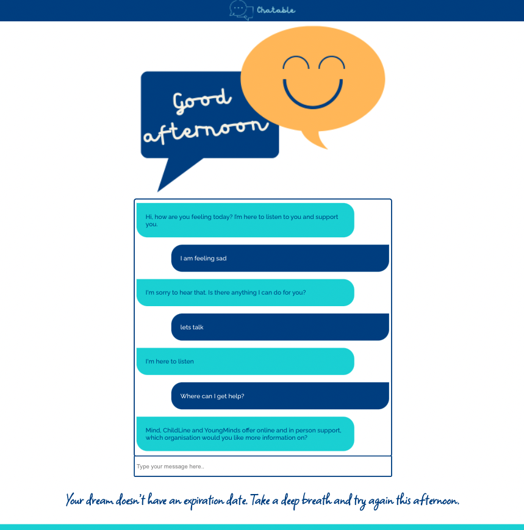
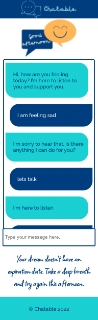

# Chatable - front-end :speech_balloon:

## About

A chatbot programmed to operate as a youth mental health first aider with a focus on despression and anxiety. Built using React as part of the [Manchester Codes](https://www.manchestercodes.com) software engineering bootcamp. 

### Desktop view

### Mobile view

## Getting started 

- Fork and close this repo
  * e.g. `git clone git@github.com:EmilyRoseCotter/chatable-front-end.git`
- Change directory into the repo
  * e.g.  (or the directory you specified the repo to be cloned into)
- Install the dependencies from `package-lock.json`
  * `npm install`
- To start the app:
  * `npm start`

## Tech stack

Here is an overview of the tech stack that the Chatable app uses:
- JavaScript
- React
- React router dom
- Node.js
- Axios
- .env
- CSS

## Authors
Emily Cotter and [July Moss](https://github.com/JMoss89)