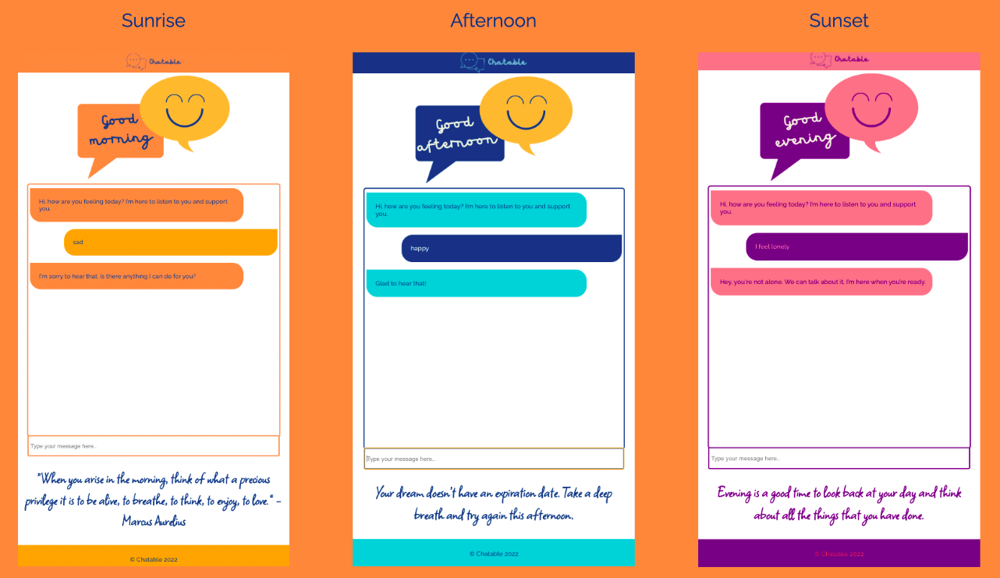

# Chatable - front-end :speech_balloon:

  

***

## About 👩🏻‍💻 👩‍💻

A chatbot programmed to operate as a youth mental health first aider with a focus on despression and anxiety. Built using React as part of the [Manchester Codes](https://www.manchestercodes.com) software engineering bootcamp. 

The back end for this app can be found [here](https://github.com/JMoss89/chatable-backend).

## Why Chatable? 🌿

Mental health illness can be hard to talk about sometimes. Chatable provides a safe space for young people to talk and seek for professional supports. As an online youtn mental health first aider, Chatable fills the gap between professional support and young people, and to encourage young people to seek for professional medical help.

### Desktop view

### Mobile view
The colour palette, greeting grapic and inspirational quote changes at different intervals throughout the day.

## Installation ⌨️

- Fork and close this repo
  * e.g. `git clone git@github.com:EmilyRoseCotter/chatable-front-end.git`
- Change directory into the repo
  * e.g.  (or the directory you specified the repo to be cloned into)
- Install the dependencies from `package-lock.json`
  * `npm install`
- To start the app:
  * `npm start`

## Tech stack 💡

Here is an overview of the tech stack that the Chatable app uses:
- JavaScript
- React
- React router dom
- Node.js
- Axios
- PropTypes
- .env
- CSS
- eslint 
- Prettier 

## Authors
Emily Cotter and [July Moss](https://github.com/JMoss89)